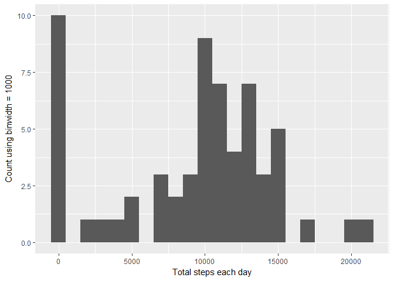
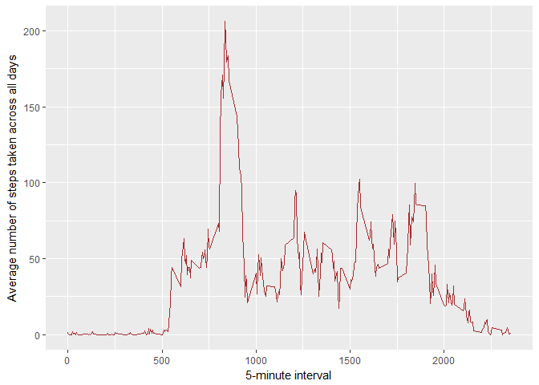

---
Check that home directory is default
> path.expand("~/")
[1] "C:/Users/username/Documents/"
---

### Loading libraries and some housekeeping before starting


```r
library(ggplot2)
library(scales)
library(stats)
library(tidyr)
library(lattice)
library(mice)
```

```
## 
## Attaching package: 'mice'
```

```
## The following object is masked from 'package:tidyr':
## 
##     complete
```

```r
library(Hmisc)
```

```
## Warning: package 'Hmisc' was built under R version 3.4.4
```

```
## Loading required package: survival
```

```
## Loading required package: Formula
```

```
## 
## Attaching package: 'Hmisc'
```

```
## The following objects are masked from 'package:base':
## 
##     format.pval, units
```

```r
library(DMwR)
```

```
## Warning: package 'DMwR' was built under R version 3.4.4
```

```
## Loading required package: grid
```

```r
setwd("~/GitHub/RepData_PeerAssessment1")
```

## Loading and preprocessing the data


```r
if(!file.exists('activity.csv')){
        unzip('activity.zipMiss <- function(x){sum(is.na(x))/length(x)*100}p')
}
activity <- read.csv('activity.csv')
```
#### Having a quick look at the data


```r
names(activity)
```

```
## [1] "steps"    "date"     "interval"
```


```r
head(activity, n = 3L)
```

```
##   steps       date interval
## 1    NA 2012-10-01        0
## 2    NA 2012-10-01        5
## 3    NA 2012-10-01       10
```


## What is mean total number of steps taken per day?


```r
stepsDay <- tapply(activity$steps, activity$date, sum, na.rm=TRUE)
```


#### 1. Make a histogram of the total number of steps taken each day


```r
qplot(stepsDay, xlab='Total steps each day', ylab='Count using binwidth = 1000', binwidth=1000)
```

<!-- -->

#### 2. Calculate and report the mean and median total number of steps taken per day


```r
stepsDayMean <- mean(stepsDay)
print(stepsDayMean)
```

```
## [1] 9354.23
```

```r
stepsDayMedian <- median(stepsDay)
print(stepsDayMedian)
```

```
## [1] 10395
```

---
* Mean: 9354.2295082
* Median:  10395
---

## What is the average daily activity pattern?


```r
avgSteps <- aggregate(x=list(meanSteps=activity$steps), by=list(interval=activity$interval), FUN=mean, na.rm=TRUE)
```

#### 1. Time series plot of the 5-minute interval (x-axis) and the average number of steps taken, averaged across all days (y-axis)


```r
ggplot(data=avgSteps, aes(x=interval, y=meanSteps)) +
    geom_line(colour = "brown") +
    xlab("5-minute interval") +
    ylab("Average number of steps taken across all days") 
```

<!-- -->

#### 2. Which 5-minute interval, on average across all the days in the dataset, contains the maximum number of steps?


```r
mostSteps <- which.max(avgSteps$meanSteps)
timeMostSteps <-  gsub("([0-9]{1,2})([0-9]{2})", "\\1:\\2", avgSteps[mostSteps,'interval'])
print(timeMostSteps)
```

```
## [1] "8:35"
```

## Imputing missing values

##### 1. Calculate and report the total number of missing values in the dataset (i.e. the total number of rows with NAs)


```r
missingValues <- length(which(is.na(activity$steps)))
print(missingValues)
```

```
## [1] 2304
```


```r
anyNA(activity$steps)
```

```
## [1] TRUE
```

##### 2. Devise a strategy for filling in all of the missing values in the dataset. The strategy does not need to be sophisticated. For example, you could use the mean/median for that day, or the mean for that 5-minute interval, etc.


```r
activityImputedMean <- activity
activityImputedMean$steps <- impute(activity$steps, fun = mean)
```

###### Quick check


```r
missingValuesMean <- length(which(is.na(activityImputedMean$steps)))
print(missingValuesMean)
```

```
## [1] 0
```


```r
anyNA(activityImputedMean$steps)
```

```
## [1] FALSE
```

##### 3. Create a new dataset that is equal to the original dataset but with the missing data filled in.


## Are there differences in activity patterns between weekdays and weekends?

#### For this part the weekdays() function may be of some help here. Use the dataset with the filled-in missing values for this part.

#### 1. Create a new factor variable in the dataset with two levels - "weekday" and "weekend" indicating whether a given date is a weekday or weekend day.

#### 2. Panel plot containing a time series plot of the 5-minute interval (x-axis) and the average number of steps taken, averaged across all weekday days or weekend days (y-axis). 


## Additional information
